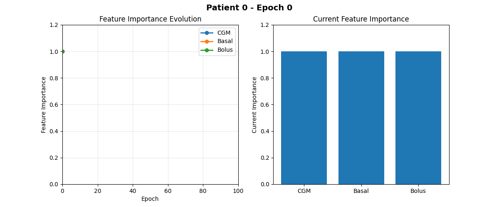

# Trend-Weighted Multi-Resolution Transformer (TW-MRT) for Glucose Prediction

This repository contains the official implementation of the **TW-MRT** model proposed in the paper:

> **Trend-Weighted Multi-Resolution Transformer for Multi-Parametric Glucose Prediction**

## 📌 Overview

TW-MRT is a novel deep learning model designed to accurately predict future blood glucose levels using multi-parametric time-series data. It combines trend-weighting, multi-resolution analysis, and transformer-based attention mechanisms to capture both short- and long-term glucose dynamics.

## 🧪 Features

**Model Features:**
- Trend-weighted embedding mechanism
- Multi-resolution temporal feature fusion
- Transformer encoder with time-aware inputs
- Support for prediction horizons ranging from 15 to 120 minutes
- Evaluated on the OhioT1DM dataset
- Features Importance
  

**Reproducibility Features:**
- 🐳 **Docker Support**: Complete containerization for environment consistency
- 📋 **Configuration Management**: YAML-based hyperparameter management
- 📊 **Comprehensive Logging**: Detailed training logs with TensorBoard support
- 🔄 **Deterministic Training**: Fixed seeds and deterministic operations
- 💾 **Complete Experiment Tracking**: All parameters, results, and models saved
- 📈 **Real-time Monitoring**: TensorBoard integration for training visualization

## 📂 Repository Structure

```bash
.
├── main.py               # Main script to run training/evaluation
├── model.py              # TW-MRT model definition
├── utils.py              # Utility functions (data loading, metrics, etc.)
├── requirements.txt      # Python dependencies
└── README.md             # This file

⚙️ Installation & Reproducibility

**🔄 For Full Reproducibility (Recommended)**

See [REPRODUCIBILITY.md](REPRODUCIBILITY.md) for comprehensive instructions including Docker setup, detailed configuration, and training logs.

**Quick Start with Docker:**
```bash
git clone https://github.com/your-username/glucose-prediction-TW-MRT.git
cd glucose-prediction-TW-MRT
docker-compose build
docker-compose run tw-mrt python main_reproducible.py
```

**Manual Installation:**

1. Clone the repository:
```bash
git clone https://github.com/your-username/glucose-prediction-TW-MRT.git
cd glucose-prediction-TW-MRT
```

2. Create a virtual environment (optional but recommended):
```bash
python -m venv venv
source venv/bin/activate  # On Windows: venv\Scripts\activate
```

3. Install dependencies:
```bash
pip install -r requirements.txt
```

📊 Dataset

This project uses the OhioT1DM Dataset for training and evaluation. Please follow their terms for data usage.

🖥️ Computational Setup
Experiments were run on:

Intel Core i9 CPU

NVIDIA RTX 2080 Ti GPU (11GB)

PyTorch 2.1.0

CUDA 11.8

Windows 10


📄 License
This code is provided for academic research purposes only.

📬 Contact
For any questions, feel free to contact:
Ömer Atılım Koca
atilimkoca@gmail.com
Izmir Katip Celebi University

